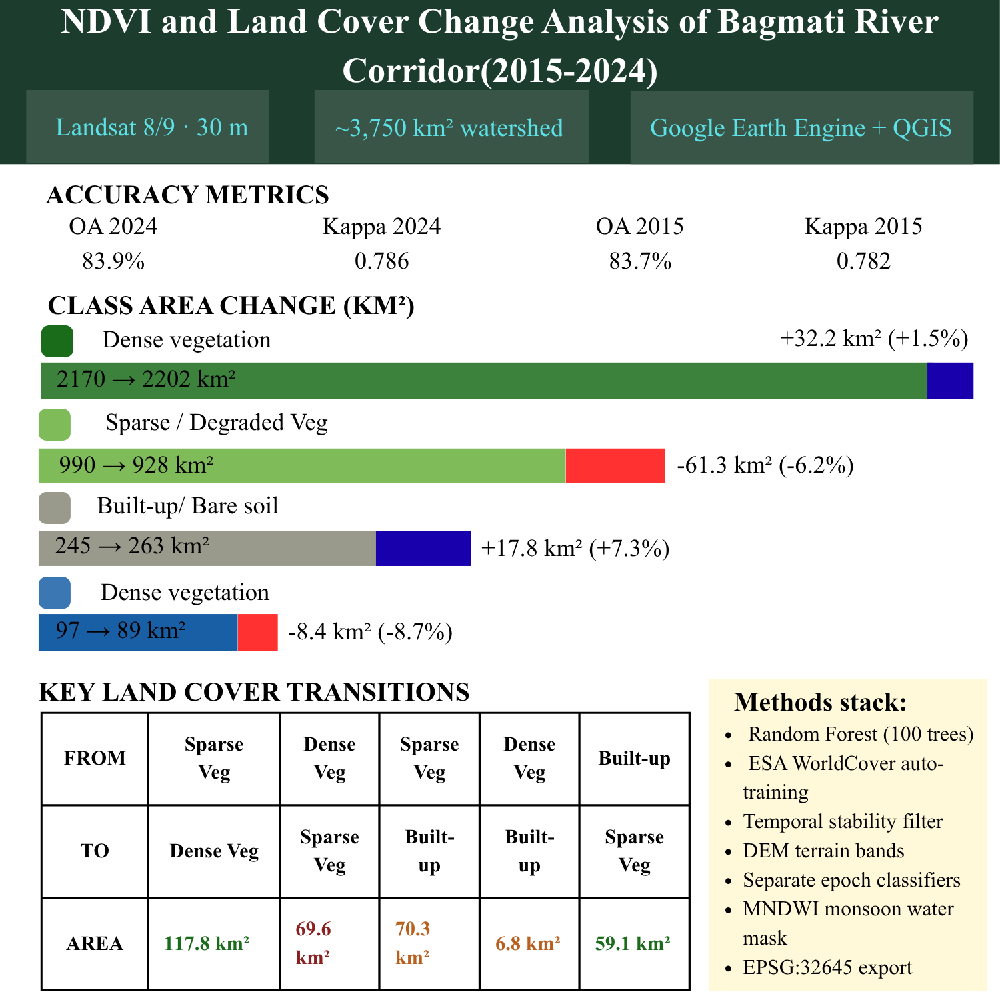

# 🌍 Bagmati River Corridor LULC Change Analysis (2015–2024)

## 📌 Project Overview
This project maps and analyzes land cover changes over a 9-year period (2015–2024) across the Bagmati River watershed in Nepal (~3,750 km²), stretching from Kathmandu down to Rautahat. This vital corridor faces intense, simultaneous pressure from rapid urban expansion, agricultural transformations, and climate-driven hydrological shifts.

Using **Google Earth Engine (GEE)** and **QGIS**, this pipeline processes dry-season Landsat 8 (2015) and Landsat 9 (2024) surface reflectance composites. A Random Forest classifier categorizes the landscape into four distinct land cover types to accurately quantify environmental dynamics.

---

## 📊 Key Findings & Summary
* **🌲 Forest Recovery (+117.8 km²):** Sparse vegetation recovered to dense forest, indicating positive landscape conservation and active reforestation initiatives, particularly along parts of the Chure range.
* **⚠️ Forest Degradation (-69.6 km²):** Dense forest tracks degraded into sparse or fragmented vegetation.
* **🏗️ Urban Expansion (+70.3 km²):** Agricultural land and sparse areas were converted into built-up infrastructure, reflecting the heavy urbanization footprint of the corridor.
* **💧 Hydrological Shifts:** Major channel migrations and floodplain variations were captured in the southern Terai region.

---

## 🛠️ Methodology & Technical Features
To achieve an **Overall Accuracy of ~84%** across both epochs, this workflow implements several advanced remote sensing techniques:

1. **Automated Training Pipelines:** Replaced traditional, tedious manual digitization by extracting a reproducible 600-sample training set directly from **ESA WorldCover 2021** using stratified random sampling.
2. **Temporal Stability Filter:** Applied a strict NDVI difference threshold ($|NDVI_{2024} - NDVI_{2015}| < 0.10$) prior to extracting 2015 training coordinates. This prevents 2021 land cover labels from "poisoning" historical training pixels that had already undergone changes.
3. **Topographic Context Fusion:** Incorporated Copernicus DEM-derived terrain bands (**elevation, slope, and aspect**) directly into the Random Forest feature stack to dramatically reduce terrain-shadow misclassifications in Nepal's complex mountain topography.
4. **Epoch-Specific Classifiers:** Rather than using a single model, separate Random Forest classifiers (100 trees) were trained independently on 2015 and 2024 spectral data to account for variations in sensor calibrations and atmospheric baselines.
5. **Seasonal Hydrological Masking:** Deployed a modified monsoon-season MNDWI mask to correctly isolate and classify the seasonally dry Bagmati riverbed as water, avoiding systemic misclassification as bare soil or built-up area.

**Data & Infrastructure:** Google Earth Engine (JavaScript API), QGIS, Landsat Collection 2 (Tier 1 SR), ESA WorldCover v200, Copernicus DEM (30m).

---

## 🗺️ Spatial Visualizations

### 1. Land Use / Land Cover Classification (2015 vs. 2024)
The classified maps illustrate the baseline distribution of dense vegetation, sparse vegetation, built-up areas, and water bodies across the watershed, pinpointing heavy urban growth around the valley floor and agricultural zones.

### 2. NDVI Vegetation Index & Landscape Greenness
The Normalized Difference Vegetation Index (NDVI) profiles highlight density changes in the canopy layer, validating the areas of forest recovery observed within the Chure range intervals.

---

## 📈 Interactive Transition Modeling (Sankey Diagram)
To ensure absolute mathematical consistency, an exact land cover transition matrix was computed for all cloud-free, unmasked pixels present across both study years. 

Instead of dealing with static mismatching graphics, the transitions are modeled programmatically. The logic aggregates specific trajectory values (e.g., Dense Forest to Built-up) to yield an internally consistent flow network.

* **To generate the interactive visualization:** Run the included `sankey_diagram.py` script. This script utilizes Python's `Plotly` engine to render a dynamic Sankey diagram where the node area totals perfectly balance the individual inbound and outbound trajectory paths.

---

## 📂 Repository Structure
* `bagmati_lulc.js` : Full production JavaScript pipeline ready to copy-paste directly into the Google Earth Engine Code Editor.
* `sankey_diagram.py` : Clean Python script containing the raw console-derived transition matrix and Plotly layout properties.
* `Work summary Bagmati Corridor.png` : Core project infographic highlighting key classification targets and statistical breakdowns.
* `LULC Bagmati.png` : Final cartographic layout comparing 2015 and 2024 classification outputs.
* `NDVI Bagmati.png` : Visual comparative maps of vegetation index performance across the watershed corridor.

---
*Developed as part of an advanced geospatial analysis portfolio series.*
